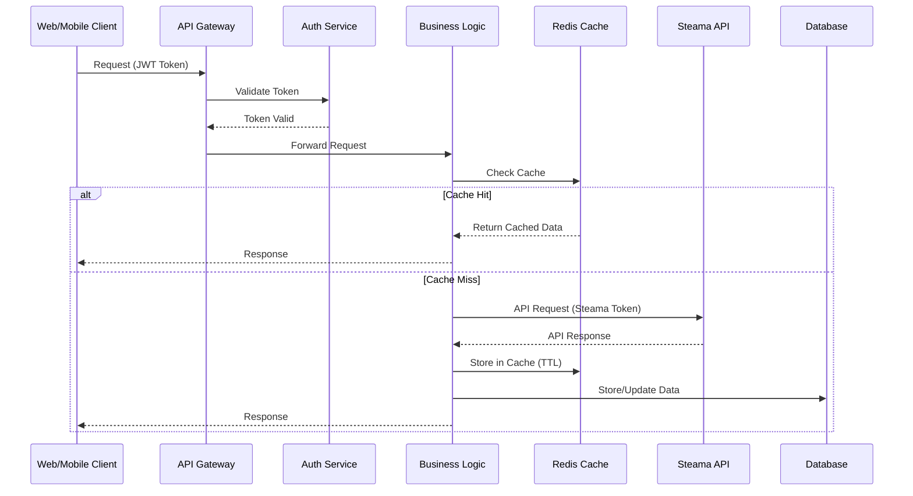
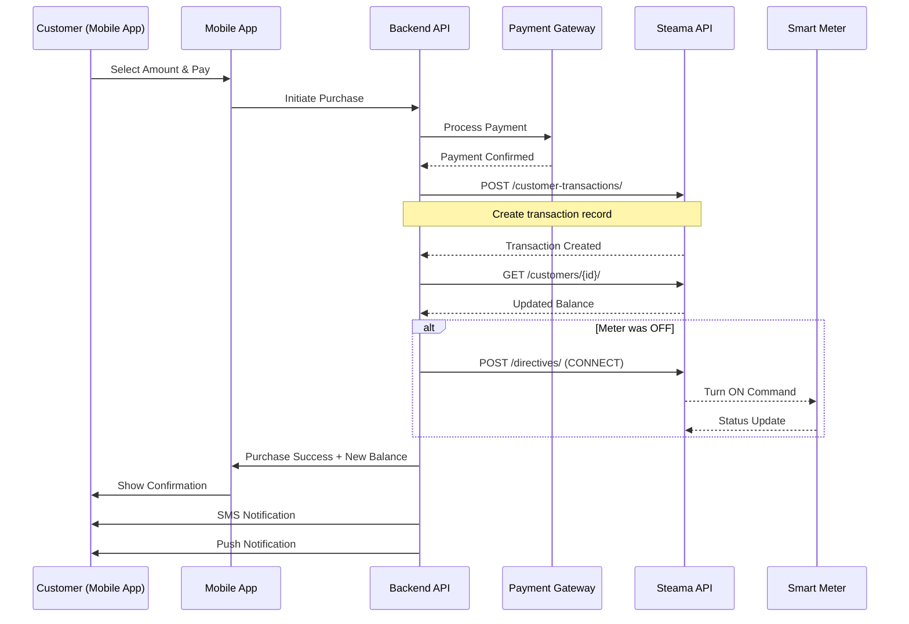
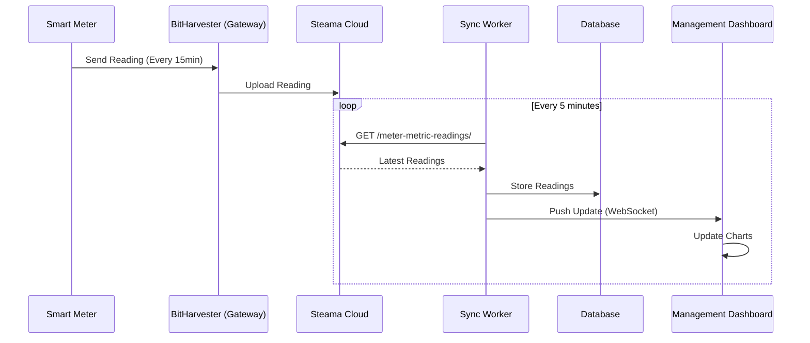
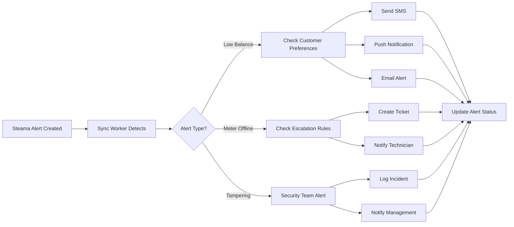
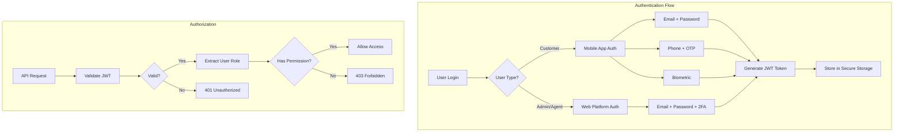
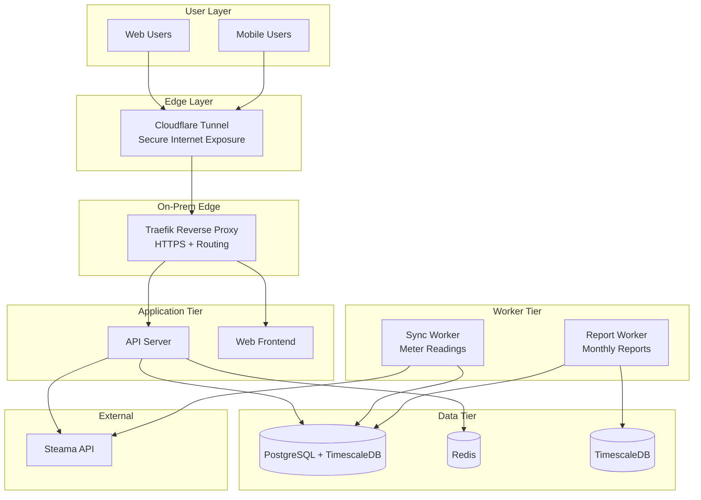
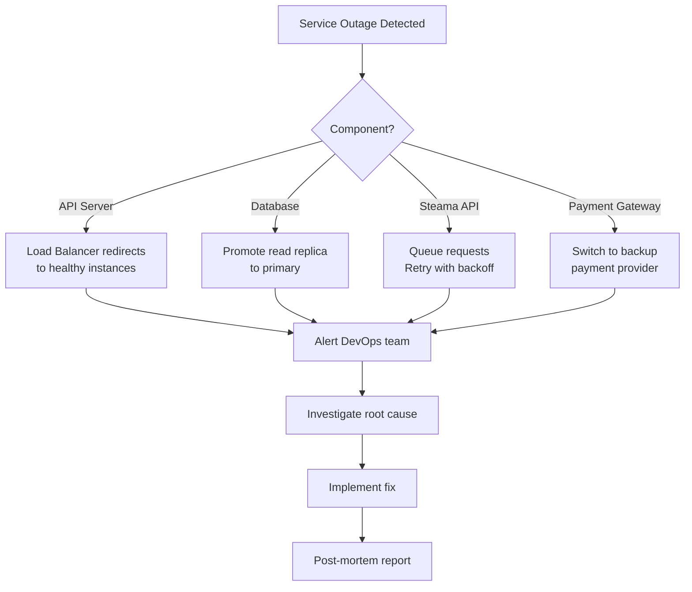

# MicroAccess Smart Metering (MSM) - Technical Architecture Document

**Project:** Custom Metering Management Platform & Mobile Application  
**Integration Partner:** Steama API Platform  
**Version:** 1.0  
**Date:** July 7, 2026  
**Author:** sadiq.yusuf

---

##  Table of Contents
1. [Executive Summary](#executive-summary)
2. [System Architecture Overview](#system-architecture-overview)
3. [Integration Architecture](#integration-architecture)
4. [Data Flow Diagrams](#data-flow-diagrams)
5. [Technology Stack](#technology-stack)
6. [Security Architecture](#security-architecture)
7. [Deployment Architecture](#deployment-architecture)
8. [API Integration Details](#api-integration-details)
9. [Database Schema](#database-schema)
10. [Scalability & Performance](#scalability--performance)

---

## 1. Executive Summary

### 1.1 Project Overview
MicroAccess Smart Metering (MSM) is a comprehensive metering management solution consisting of:
- **Management Platform** (Web-based): Meter readings, monthly reporting, and customer spend tracking
- **Mobile Application** (iOS/Android): Customer self-service for unit purchases and consumption tracking

Current operational context:
- ~30+ meters in one plaza (Abuja)
- 3 bulk meters + prepaid downstream meters
- Single-site operation today, multi-site capable model for future expansion

### 1.2 Integration Strategy
The system integrates with **Steama API** as the backend metering infrastructure, providing:
- Real-time meter data synchronization
- Customer transaction processing
- Remote meter control capabilities
- Comprehensive analytics and reporting

### 1.3 Key Differentiators
- Modern, intuitive UI/UX (futuristic design)
- Real-time data visualization aligned to available APIs
- Precision monthly reporting (kWh and spending)
- Seamless mobile payment integration
- Automated alerts and notifications

---

## 2. System Architecture Overview

```mermaid
graph TB
    subgraph "Client Layer"
    WEB[Web Management Platform<br/>SvelteKit]
    MOBILE[Mobile App<br/>Flutter]
    end
    
    subgraph "Application Layer"
    EDGE[Reverse Proxy<br/>Traefik + Cloudflare Tunnel]
    AUTH[Authentication Service<br/>JWT]
    BIZ[Business Logic Layer<br/>Node.js Fastify]
    end
    
    subgraph "Integration Layer"
        CACHE[Redis Cache<br/>API Response Caching]
    QUEUE[Message Queue<br/>BullMQ (Redis)]
        WORKER[Background Workers<br/>Data Sync & Processing]
    end
    
    subgraph "External Services"
        STEAMA[Steama API Platform<br/>https://api.steama.co]
    PAYMENT[Payment Gateway<br/>Flutterwave/Paystack]
    SMS[SMS Service<br/>Termii/Provider API]
        PUSH[Push Notifications<br/>FCM/APNS]
    end
    
    subgraph "Data Layer"
        DB[(PostgreSQL<br/>Primary Database)]
    ANALYTICS[(TimescaleDB<br/>Time-Series Analytics)]
    FILES[Local/MinIO Storage<br/>Reports and Exports]
    end
    
  WEB --> EDGE
  MOBILE --> EDGE
  EDGE --> AUTH
    AUTH --> BIZ
    BIZ --> CACHE
    BIZ --> QUEUE
    BIZ --> DB
    BIZ --> STEAMA
    QUEUE --> WORKER
    WORKER --> STEAMA
    WORKER --> DB
    WORKER --> ANALYTICS
    BIZ --> PAYMENT
    BIZ --> SMS
    BIZ --> PUSH
    WORKER --> FILES
    
    style STEAMA fill:#ff6b6b
    style WEB fill:#4ecdc4
    style MOBILE fill:#4ecdc4
    style DB fill:#95e1d3
    style ANALYTICS fill:#95e1d3
```

---

## 3. Integration Architecture

### 3.1 Steama API Integration Pattern



### 3.2 Integration Layers

#### Layer 1: API Abstraction Layer
- **Purpose:** Abstract Steama API complexity
- **Technology:** RESTful wrapper service
- **Features:**
  - Request/response transformation
  - Error handling and retry logic
  - Rate limiting compliance (10 req/sec)
  - Response caching

#### Layer 2: Data Synchronization Layer
- **Purpose:** Keep local data in sync with Steama
- **Technology:** Event-driven workers
- **Features:**
  - Scheduled data pulls (meter readings, customer data)
  - Real-time transaction updates
  - Webhook listeners (if available)
  - Conflict resolution

#### Layer 3: Business Logic Layer
- **Purpose:** Custom business rules and features
- **Technology:** Modular monolith (upgrade path to microservices later)
- **Features:**
  - Meter reading ingestion/sync
  - Monthly kWh and spend reports
  - Customer transaction flows
  - Alerts and notifications

---

## 4. Data Flow Diagrams

### 4.1 Customer Purchase Flow (Mobile App)



### 4.2 Real-Time Meter Reading Flow



### 4.3 Alert & Notification Flow



---

## 5. Technology Stack

### 5.1 Frontend Technologies

#### Management Platform (Web)
```yaml
Framework: SvelteKit
Language: TypeScript
UI Library: 
  - Custom design system (Micro Access palette)
  - Utility CSS with reusable components
Charts: 
  - Chart.js (reporting and usage trends)
State Management: Svelte stores
Real-time: Socket.io client / Server-Sent Events
Build Tool: Vite
```

#### Mobile Application
```yaml
Framework: Flutter 3.x (Recommended)
Language: Dart
State Management: Riverpod
Local Storage: Hive / SQLite
HTTP Client: Dio
Push Notifications: Firebase Cloud Messaging
```

### 5.2 Backend Technologies

```yaml
API Server:
  - Primary: Node.js + Fastify
  - Language: TypeScript
  
Authentication:
  - JWT (JSON Web Tokens)
  - Role-based access control
  
API Gateway:
  - Traefik (on-prem)
  - Features: Rate limiting, authentication forwarding, logging
  
Background Workers:
  - Node.js + BullMQ
  - Redis as message broker
  
Real-time Communication:
  - WebSocket (Socket.io / ws)
  - Server-Sent Events (SSE)
```

### 5.3 Data Layer

```yaml
Primary Database:
  - PostgreSQL 15+ (ACID compliance)
  - Use Cases: Users, transactions, customers, meters
  
Time-Series Database:
  - TimescaleDB (PostgreSQL extension)
  - Use Cases: meter readings, kWh aggregates, monthly reports
  
Caching:
  - Redis 7+ (In-memory cache)
  - Cache Strategy: Cache-aside pattern
  - TTL: 5-60 minutes based on data type
  
Object Storage:
  - Local filesystem / MinIO (self-hosted)
  - Use Cases: Reports, exports, logs
```

### 5.4 DevOps & Infrastructure

```yaml
Containerization:
  - Docker
  - Docker Compose (development)
  
Orchestration:
  - Docker Compose (production on-prem)
  - Kubernetes optional for future scale
  
CI/CD:
  - GitHub Actions / GitLab CI
  - Automated testing & deployment
  
Monitoring:
  - Application: Prometheus + Grafana
  - Logs: Loki + Promtail
  - Metrics: Prometheus + Grafana
  
Hosting:
  - On-Prem: Local server in Abuja site
  - Edge Access: Cloudflare Tunnel
```

---

## 6. Security Architecture

### 6.1 Authentication & Authorization



### 6.2 Security Layers

#### Layer 1: Network Security
- HTTPS/TLS 1.3 for all communications
- API Gateway with DDoS protection
- Firewall rules (allow-list approach)
- VPN for admin access

#### Layer 2: Application Security
- **Input Validation:** All user inputs sanitized
- **SQL Injection Prevention:** Parameterized queries
- **XSS Protection:** Content Security Policy (CSP)
- **CSRF Protection:** Token-based validation
- **Rate Limiting:** Per user and IP-based

#### Layer 3: Data Security
- **Encryption at Rest:** AES-256 for sensitive data
- **Encryption in Transit:** TLS 1.3
- **Token Storage:** 
  - Web: httpOnly cookies + localStorage
  - Mobile: Secure KeyChain (iOS) / KeyStore (Android)
- **PII Protection:** Hashing for sensitive fields

#### Layer 4: API Security
```yaml
Steama API Token Management:
  - Server-side storage only (never expose to client)
  - Rotation: Every 90 days
  - Encryption: Environment variables encrypted
  - Access: Only backend services
  
Rate Limiting:
  - Steama API: 10 requests/sec (compliance)
  - Our API: 100 requests/min per user
  - Burst handling: Queue mechanism
```

### 6.3 Compliance & Auditing

```yaml
Audit Logging:
  - All API requests logged
  - User actions tracked
  - Financial transactions immutable
  - Retention: 7 years
  
Data Privacy:
  - GDPR/NDPR compliance
  - User consent management
  - Right to deletion
  - Data anonymization for analytics
  
PCI DSS Compliance:
  - No card data stored locally
  - Payment gateway handles PCI
  - Tokenization for recurring payments
```

---

## 7. Deployment Architecture

### 7.1 Production Environment



### 7.2 Environment Strategy

```yaml
Development:
  - Local Docker Compose
  - Mock Steama API (test data)
  - Hot reload enabled
  
Staging:
  - On-prem staging node
  - Steama API sandbox (if available)
  - Mirrors production configuration
  - Used for QA testing
  
Production:
  - On-prem deployment (single site)
  - Cloudflare Tunnel internet routing
  - 99.5% uptime SLA target (single-node baseline)
  - Real Steama API integration
```

---

## 8. API Integration Details

### 8.1 Steama API Wrapper Service

```typescript
// Example: Steama API Client Architecture
class SteamaAPIClient {
  private baseURL = 'https://api.steama.co';
  private token: string;
  private cache: RedisClient;
  private rateLimiter: RateLimiter;
  
  constructor() {
    this.token = process.env.STEAMA_API_TOKEN;
    this.rateLimiter = new RateLimiter(10, 1000); // 10 req/sec
  }
  
  async request(endpoint: string, options: RequestOptions) {
    // Rate limiting
    await this.rateLimiter.acquire();
    
    // Check cache
    const cacheKey = `steama:${endpoint}:${JSON.stringify(options)}`;
    const cached = await this.cache.get(cacheKey);
    if (cached) return JSON.parse(cached);
    
    // Make request
    const response = await axios({
      url: `${this.baseURL}${endpoint}`,
      headers: {
        'Authorization': `Token ${this.token}`,
        'Content-Type': 'application/json'
      },
      ...options
    });
    
    // Cache response
    await this.cache.setex(cacheKey, 300, JSON.stringify(response.data));
    
    return response.data;
  }
}
```

### 8.2 API Endpoint Mapping

| Frontend Action | Backend Service | Steama API | Cache TTL |
|----------------|-----------------|------------|-----------|
| Dashboard Snapshot | `/api/dashboard` | `/online-meters-counts/`, `/active-meter-counts/`, `/revenue/` | 60s |
| Meter Registry | `/api/meters` | `/meters/` | 5min |
| Meter kWh Readings | `/api/meters/:id/readings` | `/meter-metric-readings/` | 5min |
| Meter Aggregates | `/api/meters/:id/totals` | `/meter-metric-totals/` | 10min |
| Customer Profile + Balance | `/api/customers/:id` | `/customers/` | 30s |
| Purchase Units | `/api/transactions/purchase` | `/customer-transactions/` | N/A |
| Department Spend Report | `/api/reports/monthly-spend` | `/customer-transactions/`, `/revenue/` | 15min |
| Alerts Feed | `/api/alerts` | `/alerts/` | 30s |

### 8.3 Data Synchronization Strategy

```yaml
Real-time Sync (WebSocket Push):
  - Customer transactions
  - Alert creation
  - Meter status changes
  
Scheduled Sync:
  - Meter readings: Every 5 minutes
  - Customer balances: Every 10 minutes
  - Monthly rollups: Hourly refresh
  - Full reconciliation: Daily at 2 AM
  
On-demand Sync:
  - User pulls to refresh
  - After transaction completion
  - Error recovery
```

---

## 9. Database Schema

### 9.1 Core Tables

```sql
-- Users table (our system users)
CREATE TABLE users (
  id UUID PRIMARY KEY DEFAULT gen_random_uuid(),
  email VARCHAR(255) UNIQUE NOT NULL,
  password_hash VARCHAR(255) NOT NULL,
  role VARCHAR(50) NOT NULL, -- 'admin', 'agent', 'support'
  created_at TIMESTAMP DEFAULT NOW(),
  last_login TIMESTAMP
);

-- Customers (synced from Steama)
CREATE TABLE customers (
  id INTEGER PRIMARY KEY, -- Steama customer ID
  steama_data JSONB NOT NULL, -- Full Steama response
  last_synced TIMESTAMP DEFAULT NOW(),
  created_at TIMESTAMP DEFAULT NOW(),
  INDEX idx_customer_sync (last_synced)
);

-- Meters (synced from Steama)
CREATE TABLE meters (
  id INTEGER PRIMARY KEY, -- Steama meter ID
  customer_id INTEGER REFERENCES customers(id),
  reference VARCHAR(100) UNIQUE,
  steama_data JSONB NOT NULL,
  last_synced TIMESTAMP DEFAULT NOW(),
  INDEX idx_meter_customer (customer_id),
  INDEX idx_meter_sync (last_synced)
);

-- Meter readings (time-series data)
CREATE TABLE meter_readings (
  id BIGSERIAL PRIMARY KEY,
  meter_id INTEGER REFERENCES meters(id),
  metric_type VARCHAR(50), -- 'ENERGY', 'VOLTAGE', 'CURRENT'
  reading_value DECIMAL(12,4),
  timestamp TIMESTAMP NOT NULL,
  created_at TIMESTAMP DEFAULT NOW(),
  INDEX idx_readings_meter_time (meter_id, timestamp DESC)
);

-- Transactions (enhanced with local data)
CREATE TABLE transactions (
  id UUID PRIMARY KEY DEFAULT gen_random_uuid(),
  steama_transaction_id INTEGER UNIQUE, -- Steama's ID
  customer_id INTEGER REFERENCES customers(id),
  amount DECIMAL(10,2) NOT NULL,
  payment_method VARCHAR(50),
  status VARCHAR(50), -- 'pending', 'completed', 'failed'
  metadata JSONB, -- Payment gateway details
  created_at TIMESTAMP DEFAULT NOW(),
  completed_at TIMESTAMP,
  INDEX idx_txn_customer (customer_id, created_at DESC),
  INDEX idx_txn_status (status, created_at)
);

-- Alerts (synced and enhanced)
CREATE TABLE alerts (
  id BIGSERIAL PRIMARY KEY,
  steama_alert_id INTEGER UNIQUE,
  meter_id INTEGER REFERENCES meters(id),
  alert_type VARCHAR(50),
  severity VARCHAR(20), -- 'low', 'medium', 'high', 'critical'
  message TEXT,
  acknowledged BOOLEAN DEFAULT FALSE,
  acknowledged_by UUID REFERENCES users(id),
  created_at TIMESTAMP DEFAULT NOW(),
  resolved_at TIMESTAMP,
  INDEX idx_alert_meter (meter_id, created_at DESC),
  INDEX idx_alert_unresolved (resolved_at) WHERE resolved_at IS NULL
);

-- Optional notifications queue (enable only if SMS/Push is activated)
```

### 9.2 Time-Series Optimization (TimescaleDB)

```sql
-- Convert meter_readings to hypertable
SELECT create_hypertable('meter_readings', 'timestamp');

-- Create continuous aggregates for performance
CREATE MATERIALIZED VIEW meter_readings_hourly
WITH (timescaledb.continuous) AS
SELECT 
  meter_id,
  metric_type,
  time_bucket('1 hour', timestamp) AS hour,
  AVG(reading_value) AS avg_value,
  MAX(reading_value) AS max_value,
  MIN(reading_value) AS min_value,
  COUNT(*) AS reading_count
FROM meter_readings
GROUP BY meter_id, metric_type, hour;

-- Refresh policy (automatic)
SELECT add_continuous_aggregate_policy('meter_readings_hourly',
  start_offset => INTERVAL '1 month',
  end_offset => INTERVAL '1 hour',
  schedule_interval => INTERVAL '1 hour');
```

---

## 10. Scalability & Performance

### 10.1 Performance Targets

```yaml
API Response Times:
  - Dashboard load: < 500ms
  - Transaction processing: < 2s
  - Meter readings: < 1s
  - Alert notifications: < 3s
  
Throughput:
  - Concurrent users: 10,000+
  - Transactions per second: 100+
  - API requests per second: 1,000+
  
Availability:
  - Uptime: 99.9% (8.76 hours downtime/year)
  - RTO (Recovery Time Objective): < 1 hour
  - RPO (Recovery Point Objective): < 5 minutes
```

### 10.2 Scaling Strategy

#### Horizontal Scaling
```yaml
Application Tier:
  - Stateless API servers
  - Auto-scaling: CPU > 70% or Memory > 80%
  - Min instances: 2
  - Max instances: 10
  
Worker Tier:
  - Queue-based processing
  - Scale based on queue depth
  - Dedicated workers for different tasks
  
Database Tier:
  - Read replicas for read-heavy operations
  - Connection pooling (PgBouncer)
  - Vertical scaling for primary
```

#### Caching Strategy
```yaml
Layer 1 - Browser Cache:
  - Static assets: 1 year
  - API responses: 0 (no cache)
  
Layer 2 - CDN Cache:
  - Static assets: 1 week
  - API responses: 0
  
Layer 3 - Redis Cache:
  - Meter data: 5 minutes
  - Customer data: 10 minutes
  - Analytics: 30 minutes
  - Session data: 24 hours
  
Layer 4 - Database Query Cache:
  - PostgreSQL query cache enabled
  - Materialized views for complex queries
```

### 10.3 Monitoring & Alerting

```yaml
Application Metrics:
  - Request rate
  - Error rate (> 1% triggers alert)
  - Response time (p50, p95, p99)
  - Active users
  
Infrastructure Metrics:
  - CPU utilization
  - Memory usage
  - Disk I/O
  - Network throughput
  
Business Metrics:
  - Transaction success rate
  - Customer registration rate
  - Revenue per hour
  - Active meters
  
Steama Integration Metrics:
  - API request success rate
  - Rate limit usage
  - Sync lag time
  - Error frequency
```

---

## 11. Disaster Recovery & Business Continuity

### 11.1 Backup Strategy

```yaml
Database Backups:
  - Frequency: Every 6 hours
  - Retention: 30 days
  - Type: Full + incremental
  - Storage: Local encrypted backup volume / MinIO
  - Test restore: Weekly
  
Application State:
  - Configuration: Git repository
  - Secrets: Encrypted environment vault on-prem
  - Docker images: Container registry
  
Data Redundancy:
  - Primary: Local periodic snapshots
  - Standby: Secondary on-prem backup node (future)
```

### 11.2 Failover Procedures



---

## 12. Development Roadmap

### Phase 1: Foundation (Weeks 1-4)
-  Architecture design
-  Development environment setup
-  Steama API integration layer
-  Authentication service
-  Database schema implementation

### Phase 2: Core Features (Weeks 5-10)
-  Customer management APIs
-  Meter data synchronization
-  Transaction processing
-  Alert system
-  Dashboard backend

### Phase 3: Frontend Development (Weeks 8-14)
-  Management platform UI
-  Mobile app development
-  Real-time data visualization
-  Payment integration

### Phase 4: Testing & Deployment (Weeks 15-18)
-  Integration testing
-  Performance testing
-  Security audit
-  Beta deployment
-  Production launch

### Phase 5: Enhancement (Ongoing)
-  Multi-site tenancy (estates/malls)
-  Secondary backup node
-  Advanced analytics packs
-  Mobile app v2 features

---

## 13. Cost Estimation

### 13.1 Infrastructure Costs (Monthly)

```yaml
On-Prem Operations:
  - Electricity + UPS maintenance: variable
  - Internet (business link): variable
  - Hardware depreciation: variable
  - Domain + DNS + certificates: low fixed
  Total: lower recurring cost than managed cloud for current scale
  
Third-Party Services:
  - Steama API: Included in meter cost
  - Payment Gateway: 2-3% per transaction
  - SMS Service: $0.02-0.05 per SMS
  - Push Notifications: Free (FCM)
  - Monitoring: Self-hosted (Prometheus + Grafana)
  Total: Mostly variable by usage
  
Development Tools:
  - GitHub/GitLab: $20/month
  - CI/CD: Included
  - Design tools: $50/month
  Total: ~$70/month
```

---

## 14. Conclusion

This architecture provides:
- **Scalability:** Handle thousands of concurrent users
- **Reliability:** 99.5% baseline for single-site on-prem deployment
- **Security:** Multi-layer security with compliance
- **Performance:** Sub-second response times with caching
- **Maintainability:** Modular, well-documented codebase

The system integrates with Steama API using only API-supported features, prioritizing meter readings, monthly kWh reporting, and customer/department spend tracking.

---

**Next Steps:**
1. Review and approve architecture
2. Set up development environment
3. Begin Phase 1 implementation
4. Create UI/UX prototypes
5. Start development sprints

**Document Maintained By:** sadiq.yusuf  
**Last Updated:** July 7, 2026  
**Next Review:** Weekly during development


